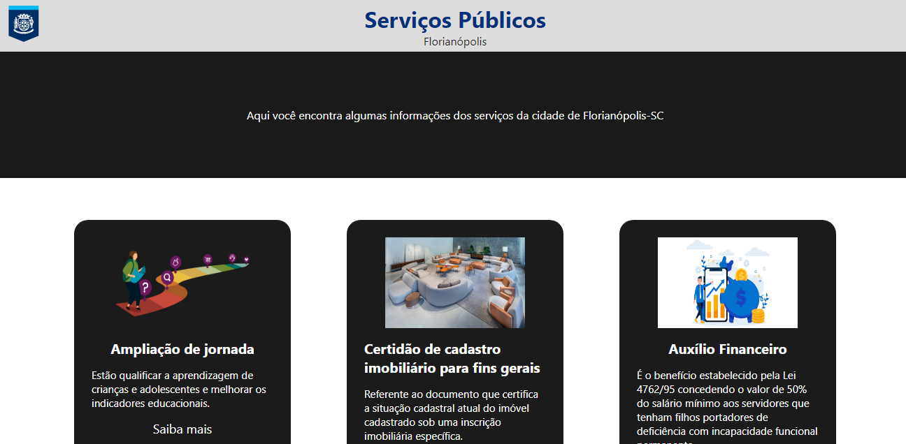

# Criação de uma landing-page para informar todos os serviços oferecidos pelo governo da cidade de Florianópolis-SC

## Objetivos:
- Aprender funcionabilidades básicas do React Native
- Aprender estilização com css
- Fazer uma landing page funcional, que leva o usuário para o site da prefeitura da cidade de Florianópolis-SC, juntando alguns dos serviços públicos oferecidos pelo governo municipal.

## Ferramentas/Linguagens

- React Native
- Css 
- Git
- Git Hub

## Imagens

## Desenvolvedores

[ Douglas Bento](https://github.com/douglasarthurr)
 
[ Jefferson Bruno](https://github.com/JeffUwU)